<!-- TOC -->

- [0. 学习目标](#0-学习目标)
- [1. 变量替换与测试](#1-变量替换与测试)
    - [1.1 变量替换](#11-变量替换)
    - [1.2 变量测试](#12-变量测试)
- [2. 字符串处理](#2-字符串处理)
    - [2.1 计算字符串长度](#21-计算字符串长度)
    - [2.2 获取子串在字符串中的索引位置](#22-获取子串在字符串中的索引位置)
    - [2.3 抽取子串](#23-抽取子串)
    - [2.4 获取子串长度](#24-获取子串长度)
    - [练习](#练习)
    - [declare和typeset命令](#declare和typeset命令)
- [数组](#数组)
- [环境变量](#环境变量)
- [bc](#bc)

<!-- /TOC -->

# 0. 学习目标
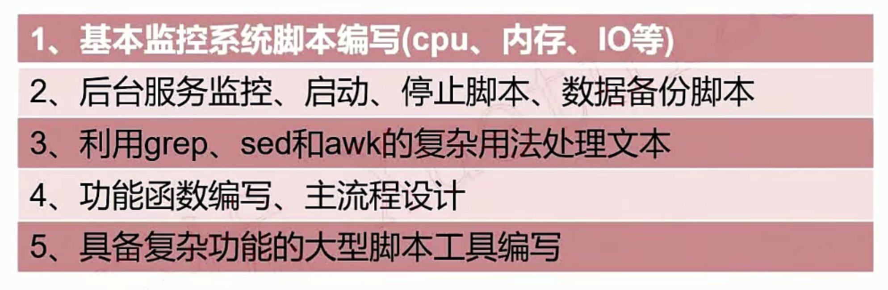

# 1. 变量替换与测试
## 1.1 变量替换
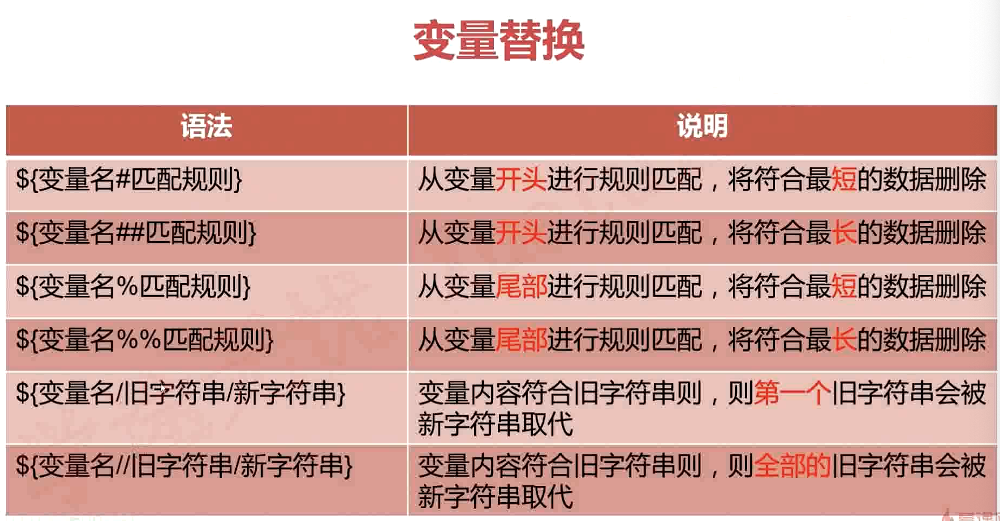
```bash
v1="I love you, Do you love me"
var1=${v1#*ov}
echo var1
e you, Do you love me

var2=${v1##*ov}
e me

v3=${v1%ov*}
v4=${v1%%ov*}

v5=${v1/ov/xx}
v5=${v1//ov/xx}

```
## 1.2 变量测试
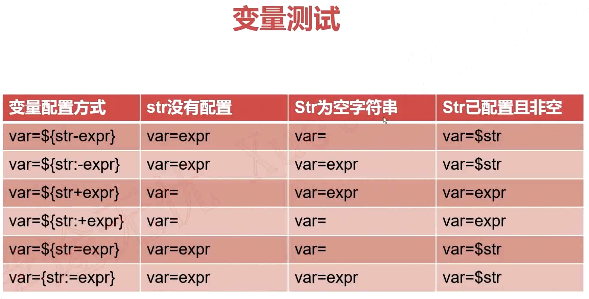

# 2. 字符串处理
## 2.1 计算字符串长度
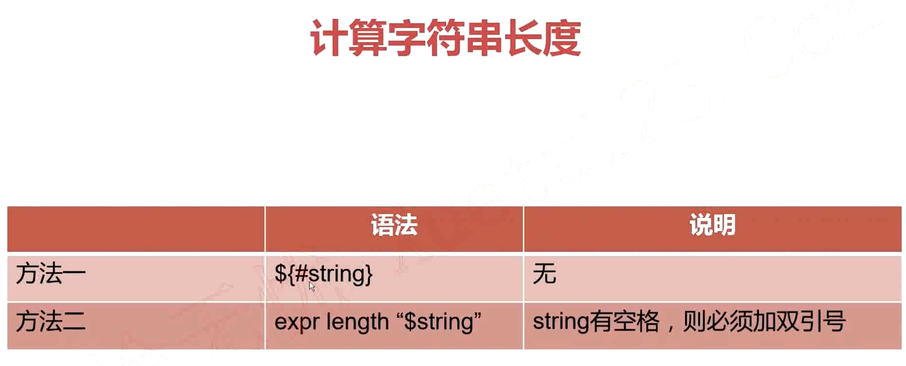
```bash
eg：
var1="hello world"
len=${#var1}
len=`expr length "$var1"`
```
## 2.2 获取子串在字符串中的索引位置
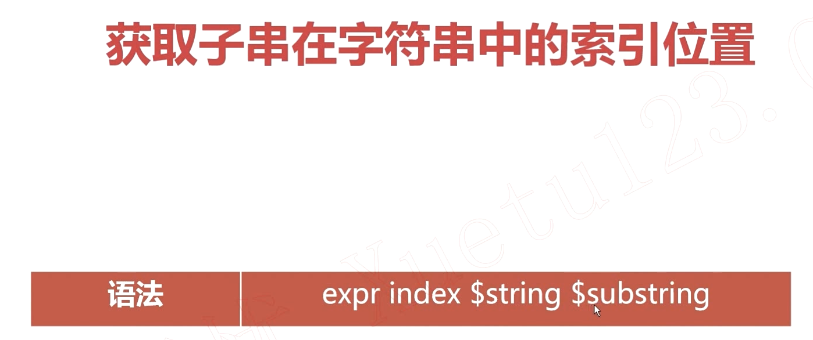
```bash
eg:
var1="quickstart is a app"
idx=`expr index "$var1"  start`
echo $idx
6
```
## 2.3 抽取子串
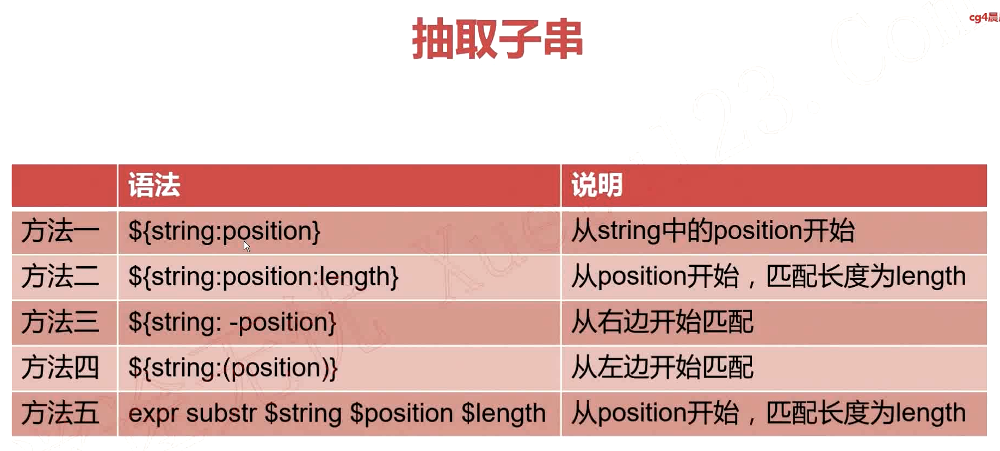
> 注意：使用expr 索引计数从1开始
  使用${string:position}, 索引计数从0开始

## 2.4 获取子串长度
```bash
方法： expr match "$string" substr （从头开始匹配）
```
## 练习
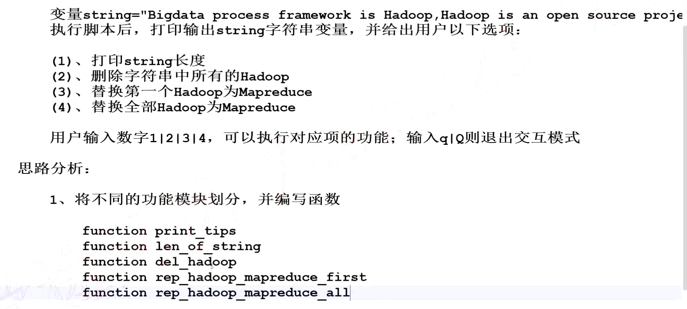

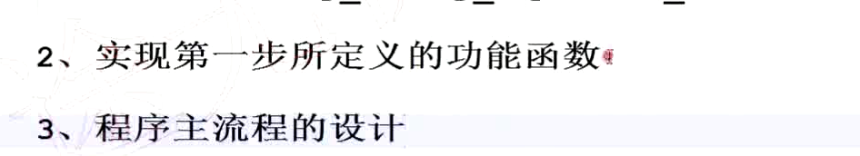

## declare和typeset命令
declare和typeset命令两者等价，都是用来定义变量类型的。
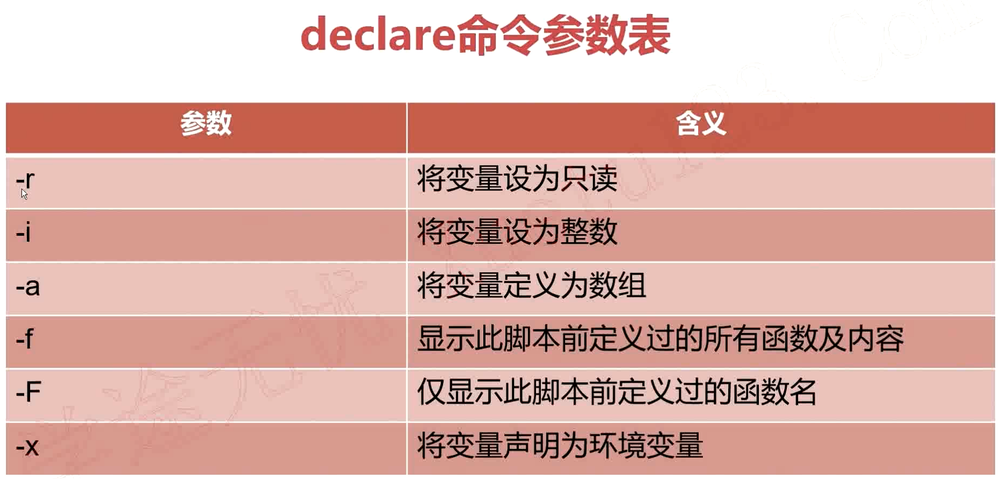

# 数组
```bash

declare -a array
array=("jones" "mike" "kobe" "jordan")
## 输出数组内容：
	echo ${array[@]}  输出全部内容
	echo ${array[1]}  输出下标索引为1的内容
## 获取数组长度：
	echo ${#array}  数组内元素个数
	echo ${#array[2]}  数组内下标索引为2的元素长度
## 给数组某个下标赋值：
	array[1]="lily"  给数组下标索引为1的元素赋值为lily
	array[20]="hanmeimei"  在数组尾部添加一个新元素
## 删除元素：
	unset  array[2]  清除元素
	unset  array  清空整个数组

## 分片访问：
	${array[@]:1:4}  显示数组下标索引从1开始到3的3个元素
## 内容替换：
	${array[@]/an/AN}  将数组中所有元素内包含an的子串替换为AN
## 数组遍历：
	for v in ${array[@]}
	do
		echo $v
done
```

# 环境变量
```bash
declare -x  声明为环境变量，可以在脚本中直接使用

取消声明的变量：
declare +r
declare +i
declare +a
declare +X
```
Bash数学运算之expr

a. expr $num1 operator $num2 操作符两边必须有空格
b. $(($num1 operator $num2))

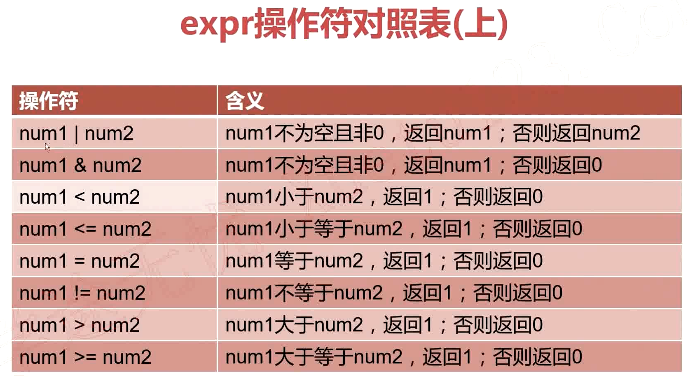
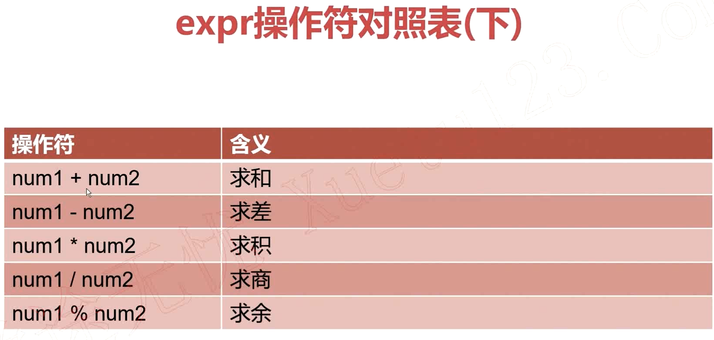
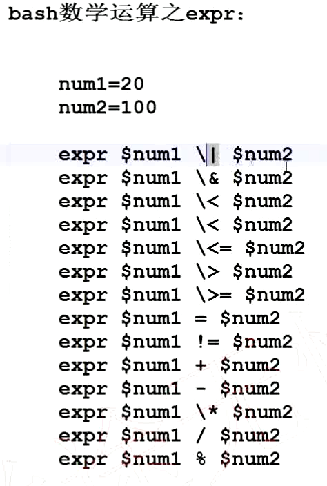
```bash
eg：
提示用户输入一个正整数num，然后计算1+2+3+。。。+num的值；
必须对num是否为正整数做判断，不符合的提示重新输入。

```

# bc
bc是bash内建的运算器，支持浮点数运算
内建变量scale可以设置，默认为0
bc操作符对照表

操作符|含义
--|--
num1 + num2 |	求和
num1 - num2	|求差
num1 * num2	|求积
num1 / num2	|求商
num1 % num2	|求余
num1 ^ num2	|指数运算

```bash
echo "23+35" | bc
echo "scale=2;4/3" | bc
var1=`echo "scale=2;4/3" | bc`
```
