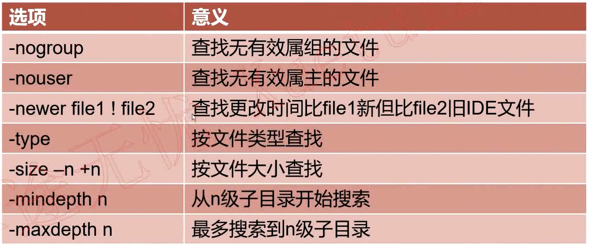
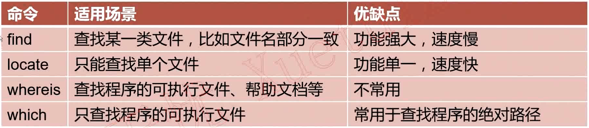

<!-- TOC -->

- [文件查找之find命令](#文件查找之find命令)
- [find命令总结：](#find命令总结)
- [逻辑运算符：](#逻辑运算符)
- [find, locate, whereis, which总结及适用场景分析](#find-locate-whereis-which总结及适用场景分析)

<!-- /TOC -->


# 文件查找之find命令


语法格式：	 find [路径] [选项] [操作]

选项|	含义
--|--
-name	|根据文件名查找
-perm	|根据文件权限查找
-prume	|该选项可以排除某些查找目录
-user	|根据文件属主查找
-group	|根据文件属组查找
-mtime -n \| +n	|根据文件更改时间查找




# find命令总结：
```bash
	常用选项：
	• -name  查找/etc目录下以conf结尾的文件， find /etc -name '*conf'
	• -iname 查找当前目录喜爱文件名为aa的文件，不区分大小写 find . -iname aa
	• -user  查找文件属主为hdfs的所有文件 find . -user hdfs
	• -group 查找文件属组为yarn的所有文件 find . -group yarn
    • -type
    	f	文件           find . -type f
		d	目录	         find . -type d
		c	字符设备文件    find . -type c
		b	块设备文件	  find . -type b
		l	链接文件	   find . -type l
		p	管道文件	   find . -type p
    	• -size
		○ -n	大小小于n的文件
		+n	大小大于n的文件
		n	大小等于n的文件
		○ eg1: 查找/etc目录下小于10000字节的文件  find /etc -size -10000c
		○ eg2:   查找/etc目录下大于1M的文件     find /etc -size +1M
	• -mtime
		○ -n	n天以内修改的文件
		+n	n天以外修改的文件
		n	正好n天修改的文件
		○ eg1: 查找/etc目录下5天之内修改且以conf结尾的文件
			§ find /etc -mtime -5 -name '*.conf'
		○ eg2: 查找/etc目录下10天之内修改且属主为root的文件
			§ find /etc -mtime +10 -user root
	• -mmin
		○ -n	n分钟以内修改的文件
		+n	n分钟以外修改的文件
		○ eg1: 查找/etc目录下30分钟之前修改的文件
			§ find /etc -mmin +30
		○ eg2: 查找/etc目录下30分钟之内修改的目录
			§ find /etc -mmin -30 -type d
	• -mindepth n      表示从n级子目录开始搜索
		○ eg：在/etc下的3级目录开始搜索
			§ find /etc -mindepth 3
	• -maxdepth n      表示最多搜索到n-1级子目录
		○ eg1: 在/etc下搜索符合条件的文件，但最多搜索到2级子目录
			§ find /etc -maxdepth 3 -name '*.conf'


操作：
	• -print 打印输出
	• -exec 对搜索到的文件执行特定的操作，格式为 -exec 'command' {} \;
		○ eg1: 搜索/tmp下的文件（非目录），文件名以conf结尾，且大于10k，然后将其删除
			§ find /tmp -type f -name '*.conf' -size +10k -exec rm -rf {} \;
		○ eg2: 将/var/log/目录下以log结尾的文件，且更改时间在7天以上的删除
			§ find /var/log/ -name '*.log' -mtime +7 -exec rm -rf {} \;
		○ eg3: 搜索条件和eg1一样，只是不删除，而是将其复制到/root/conf目录下
			§ find /tmp  -type f -name '*.conf' -size +10k -exec cp {} /root/conf/ \;
	• -ok 和exec功能一样，只是每次操作都会给用户提示
```

# 逻辑运算符：
```bash
-a	与
-o	或
-not｜!	非
	• eg1: 查找当前目录下，属主不是hdfs的所有文件
		○ find . -not -user hdfs
		○ find . ! -user hdfs
	• eg2: 查找当前目录下，属主属于hdfs，且大小大于300字节的文件
		○ find . -type f -a -user hdfs -a -size +300c
	• eg3: 查找当前目录下的属主为hdfs或者以xml结尾的普通文件
		○ find . -type f -a \( -user hdfs -o -name '*.xml' \)
```


# find, locate, whereis, which总结及适用场景分析
```
locate
	• 文件查找命令，所属软件包mlocate
	• 不同于find命令是在整块磁盘中搜索，locate命令在数据库文件中查找
	• find是默认全部匹配，locate则是默认部分匹配
	updatedb命令 (macOS: sudo /usr/libexec/locate.updatedb)
		○ 用户更新/var/lib/mlocate/mlocate.db
		○ 所使用配置文件/etc/updatedb.conf
		○ 该命令在后台cron计划任务中定期执行

whereis
选项	含义
-b	只返回二进制文件
-m	只返回帮助文档文件
-s	只返回源代码文件

which  仅查找二进制程序文件
```

