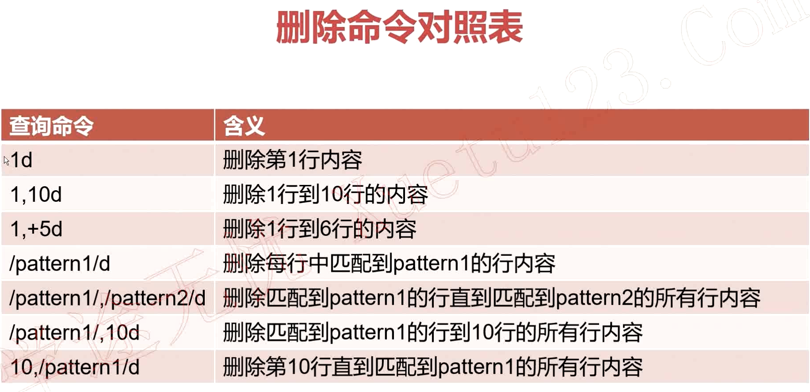

<!-- TOC -->

- [sed的工作模式](#sed的工作模式)
- [sed中的编辑命令详解](#sed中的编辑命令详解)
    - [反向引用](#反向引用)
- [利用sed查询特定内容](#利用sed查询特定内容)
    - [pattern种类：](#pattern种类)
- [脚本练习1:](#脚本练习1)
- [利用sed删除特定内容](#利用sed删除特定内容)
- [利用sed修改文件内容](#利用sed修改文件内容)
- [利用sed追加文件内容](#利用sed追加文件内容)

<!-- /TOC -->


# sed的工作模式
```
sed（Stream Editor），流编辑器。对标准输出或文件逐行进行处理。
形式1	stdout | sed [option] "pattern command"
形式2	sed [option] "pattern command" file

sed的选项
选项	含义
-n	只打印模式匹配行
-e	直接在命令行进行sed编辑，默认选项
-f	编辑动作保存在文件中，指定文件执行
-r	支持扩展正则表达式
-i	直接修改文件内容
```


```bash
	1. LineNumber 直接指定行号
	• sed -n '17p' file  打印file文件的第17行
	2. StartLine, EndLine 指定起始行号和结束行号
	• sed -n '10,20p' file 打印file文件的10到20行
	3. StartLine, +N 指定起始行号，然后后面N行
	• sed -n '10, +5p' file 打印file文件中从第10行开始，往后面加5行的所有
	4. /pattern1/  正则表达式匹配的行
	• sed -n '/^root/p' file  打印file文件中以root开头的行
	5. /pattern1/, /pattern2/ 从匹配到pattern1的行，到匹配到pattern2的行
	• sed -n '/^hdfs/, /^mail/p' file 打印file文件中从第4行开始匹配，直到以hdfs开头的行
	6. LineNumber, /pattern1/  从指定行号开始匹配，直到匹配到pattern1的行
	• sed -n '4, /^hdfs/p' file 打印file文件中从第4行开始匹配，直到以hdfs开头的行
	7. /pattern1/,LineNumber  从pattern1匹配的行开始，直到匹配到指定行号结束
    • sed -n '/root/, 10p' file   打印file文件中匹配root的行，直到第10行结束

```


# sed中的编辑命令详解


= 	显示行号

```bash
eg:
sed '10d' passwd 删除第10行， 不修改源文件
sed -i '1,3d' passwd 文件里修改，删除1-3行
sed -i '/root/a This is root!!!!' passwd 在root下面添加This is root!!!!一行
sed -n '/bin\/bash/w save.txt' passwd
sed -i 's/bin\/false/BIN\/FALSE/g' passwd
sed -n '/root/=' passwd 显示行号
```

## 反向引用
```bash
&和\1 	 引用模式匹配到的整个串
sed 's/l..e/&r/g' file  在file中搜寻以l开头，后跟两个任意字符，以e结尾的字符串，在其后添加r字符
sed 's/\(l..e\)/\1r/g' file  和上面实现一样的功能，使用\1代表搜寻到的字符串

sed中引用变量时注意事项：
（1）匹配模式中存在变量，则建议使用双引号
（2）sed中需要引入自定义变量时，如果外面使用单引号，则自定义变量也必须使用单引号
```

# 利用sed查询特定内容
## pattern种类：
	1. 8p
	2. 8, 10p
	3. 8, +5p
	4. /regexp/p
	5. /regexp_1/, /regexp_2/p
	6. 8, /regexp/p
	7. /regexp/, 8p
```bash
eg1. 打印/etc/passwd中第20行的内容
	• sed -n '20p' /etc/passwd
eg2. 打印/etc/passwd中从第8行开始，到第15行结束的内容
	• sed -n '8,15p' /etc/passwd
eg3. 打印/etc/passwd中从第8行开始，然后+5行结束的内容
	• sed -n '8, +5p' /etc/passwd
eg4. 打印/etc/passwd中开头匹配hdfs字符串的内容
	• sed -n '/^hdfs/p' /etc/passwd
eg5. 打印/etc/passwd中开头为root的行开始，到开头为hdfs的行结束的内容
	• sed -n '/^root/,/^hdfs/p' /etc/passwd
eg6. 打印/etc/passwd中第8行开始，到含有/sbin/nologin的内容的行结束内容
	• sed -n '8, /\/sbin\/nologin/p' /etc/passwd
eg7. 打印/etc/passwd中第一个包含/bin/bash内容的行开始，到第5行结束的内容
	• sed -n '/\/bin\/bash/, 5p' /etc/passwd
```

# 脚本练习1:
处理一个类似MySQL配置文件my.cnf的文本，示例如下；
编写脚本实现以下功能：输出文件有几个段，并且针对每个段可以统计配置参数总个数


function get_all_segment
function count_items_in_segment


# 利用sed删除特定内容

```bash
eg1. 删除/etc/passwd中的第15行
	• sed -i '15d' /etc/passwd
eg2. 删除/etc/passwd中的第8行到第14行的所有内容
	• sed -i '8, 14d' /etc/passwd
eg3. 删除/etc/passwd中的不能登陆的用户（筛选条件：/sbin/nologin）
	• sed -i '/\/sbin\/nologin/d' /etc/passwd
eg4. 删除/etc/passwd中以mail开头的行，到以yarn开头的行的所有内容
	• sed -i '/^mail/,/^yarn/d' /etc/passwd
eg5. 删除/etc/passwd中第一个不能登陆的用户，到第13行的所有内容
	• sed -i '/\/sbin\/nologin/, 13d' /etc/passwd
eg6. 删除/etc/passwd中第5行到以ftp开头的所有行的内容
	• sed -i '5, /^ftp/d' /etc/passwd
eg7. 删除/etc/passwd中以yarn开头的行到最后行的所有内容
	• sed -i '/^yarn/, $d' /etc/passwd


典型需求：
	1. 删除配置文件中的所有注释行和空行
	• sed -i '/\#/d; /^$/d' my.cnf
		○ sed -i '/[:blank:]*#/d' my.cnf 删除0个或多个空格开头后接#的行
	2. 在配置文件中所有不以#开头的行前面添加*符号，注意：以#开头的行不添加
	• sed -i 's/^[^\#]/*&/g' my.cnf
[^\#]表示不含#
```


# 利用sed修改文件内容

```bash
eg1. 修改/etc/passwd中第1行中第1个root为ROOT
	• sed -i '1s/root/ROOT/' passwd
eg2. 修改/etc/passwd中第5行到第10行中所有的/sbin/nologin为/bin/bash
	• sed -i '5,10s/\/sbin\/nologin/\/bin\/bash/g' passwd
eg3. 修改/etc/passwd中匹配到/sbin/nologin的行，将匹配到行中的login改为大写的LOGIN
	• sed -i '/\/sbin\/nologin/s/login/LOGIN/g' passwd
eg4. 修改/etc/passwd中从匹配到以root开头的行，到匹配到行中包含mail的所有行。修改内容为将这些所有匹配到的行中的bin改为HADOOP
	• sed -i '/^root/,/mail/s/bin/HADOOP/g' passwd
eg5. 修改/etc/passwd中从匹配到以root开头的行，到第15行中的所有行，修改内容为将这些行中的nologin修改为SPARK
	• sed -i '/^root/,15s/nologin/SPARK/g' passwd
eg6. 修改/etc/passwd中从第15行开始，到匹配到以yarn开头的所有行，修改内容为将这些行中的bin换为BIN
sed -i '15,/^yarn/s/bin/BIN/g' passwd
```

# 利用sed追加文件内容


```bash
	1. a
	eg1. passwd文件第10行后面追加"Add Line Behind"
		•  sed -i '10a Add Line Behind' passwd
	eg2. passwd文件第10行到第20行，每一行后面都追加"Test Line Behind"
		• sed -i '10,20a Test Line Behind' passwd
	eg3. passwd文件匹配到/bin/bash的行后面追加"Insert Line For /bin/bash Behind"
		• sed -i '/\/bin\/bash/a Insert Line For xxx Behind' passwd
	2. i
	eg1. passwd文件匹配到以yarn开头的行，在匹配前面追加"Add Line Before"
		• sed -i '/^yarn/i Add Line Before' passwd
	eg2. passwd文件每一行前面都追加"Insert Line Before Every Line"
		• sed -i 'i Insert Line Before Every Line' passwd
	3. r
	eg1. 将/etc/fstab文件的内容追加到passwd文件的第20行后面
		• sed -i '20r /etc/fstab' passwd
	eg2. 将/etc/inittab文件内容追加到passwd文件匹配/sbin/nologin行的后面
		• sed -i '/\/sbin\/nologin/r /etc/inittab' passwd
	eg3. 将/etc/vconsole.conf文件内容追加到passwd文件中特定行后面，匹配以ftp开头的行，到第18行的所有行
		• sed -i '/^ftp/,18r /etc/vconsole.conf' passwd
	4. w
	eg1. 将passwd文件匹配到/bin/bash的行追加到/tmp/sed.txt文件中
		• sed -i '/\bin\/bash/w /tmp/sed.txt' passwd
	 eg2. 将passwd文件从第10行开始，到匹配到hdfs开头的所有行内容追加到/tmp/sed-1.txt
sed -i '10, /^hdfs/w /tmp/sed-1.txt' passwd
```
