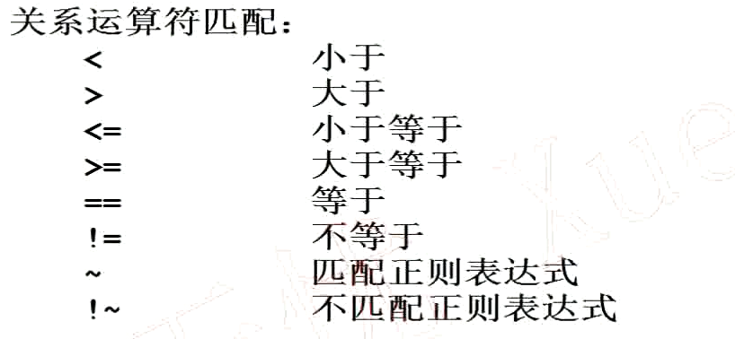

<!-- TOC -->

- [awk语法格式](#awk语法格式)
- [awk内置变量](#awk内置变量)
- [awk格式化输出之printf](#awk格式化输出之printf)
- [awk模式匹配的两种用法](#awk模式匹配的两种用法)
    - [1. RegExp](#1-regexp)
    - [2. 运算符匹配](#2-运算符匹配)
    - [布尔运算符匹配：](#布尔运算符匹配)
- [awk动作中的表达式用法](#awk动作中的表达式用法)
- [awk动作中的条件及循环语句](#awk动作中的条件及循环语句)
    - [if](#if)
    - [do while](#do-while)
    - [for循环](#for循环)
- [awk中的字符串函数](#awk中的字符串函数)
- [awk中的常用选项](#awk中的常用选项)
- [awk中数组的用法](#awk中数组的用法)
    - [Shell中数组的用法](#shell中数组的用法)

<!-- /TOC -->


# awk语法格式

awk是一个文本处理工具，通常用于处理数据并生成结果报告
```bash
形式1	awk 'BEGIN{}pattern{commands}END{}' file_name
形式2	standard output | awk 'BEGIN{}pattern{commands}END{}'
```


# awk内置变量


```bash
NF: Number Field
NR: Number Row
FNR: File Number Row
RS：Record Separator，记录分隔符
FS：Field Separator，字段分隔符
ORS：Output Record Separator，输出当前记录分隔符
OFS：Out of Field Separator，输出字段分隔符
```

# awk格式化输出之printf


```bash
格式符示例：
eg1. 以字符串格式打印/etc/passwd中的第7个字段，以":"作为分隔符
	• awk 'BEGIN{FS=":"} {printf "%s\n", $7}' passwd
eg2. 以10进制格式打印/etc/passwd中的第3个字段，以":"作为分隔符
	• awk 'BEGIN{FS=":"} {printf "%d\n", $3}' passwd
eg3. 以浮点数格式打印/etc/passwd中的第三个字段，以":"作为分隔符
	• awk 'BEGIN{FS=":"} {printf "%0.3f\n", $3}' passwd
eg4. 以16进制数格式打印/etc/passwd中的第三个字段，以":"作为分隔符
	• awk 'BEGIN{FS=":"} {printf "%#x\n", $3}' passwd
eg5. 以8进制数格式打印/etc/passwd中的第三个字段，以":"作为分隔符
	• awk 'BEGIN{FS=":"} {printf "%#o\n", $3}' passwd
eg6. 以科学计数法格式打印/etc/passwd中的第三个字段，以":"作为分隔符
	• awk 'BEGIN{FS=":"} {printf "%e\n", $3}' passwd

```


# awk模式匹配的两种用法
第一种模式匹配	RegExp
第二种模式匹配	关系运算匹配

## 1. RegExp
```bash
	eg1. 匹配/etc/passwd文件行中含有root字符串的所有行
		• awk 'BEGIN{FS=":"}/root/{print $0}' /etc/passwd
	eg2. 匹配/etc/passwd文件行中以yarn开头的所有行
		• awk 'BEGIN{FS=":"}/^yarn/{print $0}' /etc/passwd
```

## 2. 运算符匹配

```bash
eg1. 以：为分隔符，匹配/etc/passwd文件中第3个字段小于50的所有行信息
	• awk 'BEGIN{FS=":"} $3<50 {print $0}' passwd
eg2. 以：为分隔符，匹配/etc/passwd文件中第3个字段大于50的所有行信息
	• awk 'BEGIN{FS=":"} $3>50 {print $0}' passwd
eg3. 以：为分隔符，匹配/etc/passwd文件中第7个字段为/bin/bash的所有行信息
	• awk 'BEGIN{FS=":"} $7=="/bin/bash" {print $0}' passwd
eg4. 以：为分隔符，匹配/etc/passwd文件中第7个字段不为/bin/bash的所有行信息
	• awk 'BEGIN{FS=":"} $7!="/bin/bash" {print $0}' passwd
eg5. 以：为分隔符，匹配/etc/passwd文件中第3个字段包含3个以上数字的所有行信息
	• awk 'BEGIN{FS=":"} $3~/[0-9]{3,}/ {print $0}' passwd
```

## 布尔运算符匹配：

```bash
eg1. 以：为分隔符，匹配/etc/passwd文件中包含hdfs或yarn的所有行信息
	• awk 'BEGIN{FS=":"} $1=="hdfs" || $1=="yarn" {print $0}' passwd
eg2. 以：为分隔符，匹配/etc/passwd文件中第3个字段小于50并且第4个字段大于50的所有行信息
	• awk 'BEGIN{FS=":"} $3<50 && $4>50 {print $0}' passwd

```


# awk动作中的表达式用法


```bash
eg1. 使用awk计算/etc/services中的空白行数量
	• awk '/^$/{sum++}END{print sum}' /etc/services
eg2. 计算学生课程分数平均值，学生课程文件内容如下：
$ cat score
	Allen	80	90	96	98
	Mike	93	98	92	91
	Zhang	78	76	87	92
	Jerry	86	89	68	92
	• awk '{totol=$2+$3+$4+$5;avg=totol/4;printf "%-8s%-5d%-5d%-5d%-5d%0.2f\n", $1,$2, $3, $4, $5, avg}' score
eg3. 使用awk输出/etc/passwd文件的行数。分两种方式显示行数，一种是正序如1.2.3.4....
	• awk '{sum++}END{print sum}' score

```

# awk动作中的条件及循环语句
## if


```bash

eg1. 以：为分隔符，只打印/etc/passwd中第3个字段的数值在50-100范围内的行信息
	• awk 'BEGIN{FS=":"}$3>=50 && $3<=100{print $0}' passwd
awk 'BEGIN{FS=":"}{if ($3>=50&& $3<=100) print $0}' passwd
```

## do while


```bash

BEGIN{
	while(i<100)
	{
		sum+=i
		i++
	}
	print sum
}

$ awk -f while.awk

```


## for循环


```bash

BEGIN{
	for (i=0;i<100;i++)
		sum+=i
	print sum
}

eg2. 计算学生课程分数平均值，并且只打印平均分输大于90的同学姓名和分数信息。
学生课程文件内容如下：
$ cat score
	Allen	80	90	96	98
	Mike	93	98	92	91
	Zhang	78	76	87	92
	Jerry	86	89	68	92

	{
		totol=$2+$3+$4+$5
		avg=totol/4
		if(avg>=90)
			printf "%-8s%.2f\n", $1, avg
	}
	$ awk -f score.awk score


eg3. 使用awk输出/etc/passwd文件的行数。分两种方式显示行数，一种是正序如1.2.3.4....


```

# awk中的字符串函数


| length(str) | 计算长度
--|--
index(str1, str2) | 返回在str1中查询到的str2的位置
tolower(str) | 小写转换
toupper(str)  | 大写转换
split(str, arr, fs)  | 分割字符串，并保存到数组中
match(str, RE)  | 返回正则表达式匹配到的子串的位置
substr(str, m, n)  | 截取子串，从m个字符开始，截取n位。n若不指定，则默认截取到末尾
sub(RE, RepStr, str)  | 替换查找到的第一个子串
gsub(RE, RepStr, str)  | 替换查找到的所有子串

```bash
eg1: 以：为分隔符，返回/etc/passwd中每行中每个字段的长度
awk 'BEGIN{FS=":"}
{
    i=1
    while (i<=NF)
    {

        if (i==NF)
            printf "%d",length($i)
        else
            printf "%d:",length($i)
        i++
    }
    print ""
}' passwd

eg2: 搜索字符串"I have a dream"中出现"ea"字符串的位置
a. awk 'BEGIN{s="I have a dream"; print index(s, "ea")}'
b. awk 'BEGIN{print match("I have a dream", "ea")}'

eg3: 将字符串"Hadoop is a bigdata Framework"全部转换为小写
awk 'BEGIN{print tolower("Hadoop is a bigdata Framework")}'

eg4：将字符串"Hadoop is a bigdata Framework"全部转换为大写
awk 'BEGIN{print toupper("Hadoop is a bigdata Framework")}'

eg5：将字符串"Hadoop Kafka Spark Storm HDFS YARN Zookeeper", 按照空格为分隔符，分隔每部分保存到数组array中
awk 'BEGIN{
    str="Hadoop Kafka Spark Storm HDFS YARN Zookeeper";
    split(str, arr, " ")
    for (a in arr)
    {
        print arr[a]
    }
}'

WARN: awk中数组从1开始计数，Shell中数组从0开始计数。

eg6：搜索字符串"Tranction 2345 Start:Select * from master" 第一个数字出现的位置
awk '
BEGIN{
    str="Tranction 2345 Start:Select * from master"
    print match(str, /[0-9]/)
}
'

eg7: 截取字符串"transaction start"的子串，截取条件从第4个字符开始，截取5位
awk '
BEGIN{
    str="transaction start"
    print substr(str, 4, 5)
}
'

eg8: 替换字符串"Tranction 243 Start,Event ID:9002"中第一个匹配到的数字串为$符号
awk '
BEGIN{
    str="Tranction 243 Start,Event ID:9002"
    sub(/[0-9]+/,"$", str)
    print str
}
'
```

# awk中的常用选项


选项 | 含义
--|--
-v | 定义或引用变量
-f   |  指定awk命令文件
-F  |  指定分隔符
-V  |  查看awk的版本号

```bash
num1=20
var="hello world"
awk -v num2=$num1 -v var1="$var" 'BEGIN{print num2,var1}'
WARNING: 引用字符串中间有空格时，必须用双引号引起来


awk -v num2=$num1 -v var1="$var" -f test.awk

```


# awk中数组的用法
## Shell中数组的用法
```bash
array=("Allen" "Mike" "Messi" "Jerry" "Hanmeimei" "Wang")
打印元素         echo ${array[2]}
打印元素个数      echo ${#array[@]}
打印元素长度      echo ${#array[3]}
给元素赋值        array[3]="Li"
删除元素        unset array[2]; unset array
分片访问        echo ${array[@]:1:3}
元素内容替换      ${array[@]/e/E} 只替换第一个e;  ${array[@]//e/E} 替换所有的e
数组的遍历
for a in ${array}
do
    echo $a
done
```
