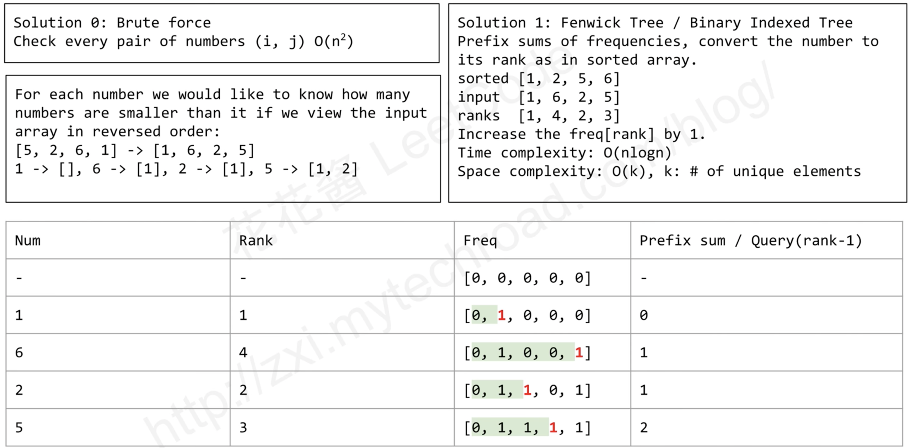
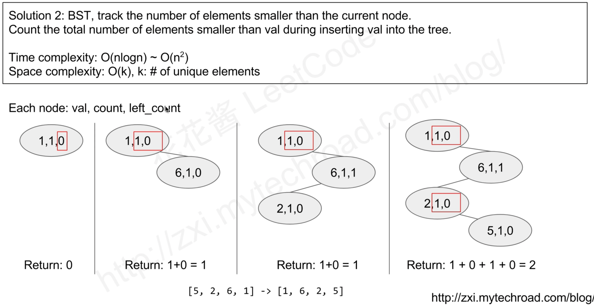

<!-- TOC -->

- [定义](#定义)
    - [leetcode](#leetcode)
    - [169. Majority Element](#169-majority-element)
    - [153. Find Minimum in Rotated Sorted Array](#153-find-minimum-in-rotated-sorted-array)
    - [154. Find Minimum in Rotated Sorted Array II](#154-find-minimum-in-rotated-sorted-array-ii)
    - [912. Sort an Array](#912-sort-an-array)
    - [LeetCode 315. Count of Smaller Numbers After Self](#leetcode-315-count-of-smaller-numbers-after-self)

<!-- /TOC -->
# 定义
使用分治法的关键线索是分割得到的子问题和原问题是相同类型的问题，区别是规模的大小，那么可以轻松地用递归来解决问题，不难想到，通常在分割问题时，子问题与原问题规模相差要足够大，解决问题的效率才会明显提高，比如可以将原问题的规模减半划为2个子问题。

### leetcode
### 169. Majority Element

A.
```python
class Solution:
    def majorityElement(self, nums: List[int]) -> int:
        def majority_element_rec(lo, hi):
            if lo == hi:
                return nums[lo]

            mid = (hi - lo) // 2 + lo
            left = majority_element_rec(lo, mid)
            right = majority_element_rec(mid+1, hi)

            if left == right:
                return left

            left_count = sum(1 for i in range(lo, hi+1) if nums[i]==left)
            right_count = sum(1 for i in range(lo, hi+1) if nums[i]==right)

            return left if left_count > right_count else right
        return majority_element_rec(0, len(nums)-1)
```

B.
```python
class Solution:
    def majorityElement(self, nums: List[int]) -> int:
        def helper(nums):
            if len(nums) > 1:
                mid = len(nums) // 2
                L = nums[:mid]
                R = nums[mid:]
                left = helper(L)
                right = helper(R)
                if left == right:
                    return left

                left_count, right_count = 0, 0
                for num in nums:
                    if num == left:
                        left_count += 1
                    elif num == right:
                        right_count += 1
                return left if left_count > right_count else right
            return nums[0]

        return helper(nums)
```
```python
C.
class Solution:
    def majorityElement(self, nums: List[int]) -> int:
        if len(nums) > 1:
            mid = len(nums) // 2
            L = nums[:mid]
            R = nums[mid:]

            left = self.majorityElement(L)
            right = self.majorityElement(R)
            if left == right:
                return left

            left_count, right_count = 0, 0
            for n in nums:
                if n == left:
                    left_count += 1
                elif n == right:
                    right_count += 1
            return left if left_count > right_count else right
        else:
            return nums[0]
```

### 153. Find Minimum in Rotated Sorted Array
```Python
class Solution:
    def findMin(self, nums: List[int]) -> int:
        left, right = 0, len(nums)-1
        while left < right:
            mid = (right + left) // 2
            if nums[mid] > nums[right]:
                left = mid + 1
            else:
                right = mid
        return nums[right]
```


### 154. Find Minimum in Rotated Sorted Array II
```Python
class Solution:
    def findMin(self, nums: List[int]) -> int:
        left, right = 0, len(nums) -1
        while left < right:
            mid = (left + right) // 2
            if nums[mid] > nums[right]:
                left = mid + 1
            elif nums[mid] < nums[right]:
                right = mid
            else:
                right -= 1
        return nums[left]
```

### 912. Sort an Array
```Python
class Solution:
    def sortArray(self, nums: List[int]) -> List[int]:
        # merge sort O(nlogn)
        if len(nums) > 1:
            mid = len(nums) // 2
            L = nums[:mid]
            R = nums[mid:]

            self.sortArray(L)
            self.sortArray(R)

            i = j = k = 0
            while i < len(L) and j < len(R):
                if L[i] < R[j]:
                    nums[k] = L[i]
                    i += 1
                else:
                    nums[k] = R[j]
                    j += 1
                k += 1

            while i < len(L):
                nums[k] = L[i]
                i += 1
                k += 1
            while j < len(R):
                nums[k] = R[j]
                j += 1
                k += 1
        return nums
```

### LeetCode 315. Count of Smaller Numbers After Self



```Python
class Solution:
    def countSmaller(self, nums: List[int]) -> List[int]:
        arr = [] # array with indexes
        res = [0] * len(nums)

        for i, num in enumerate(nums):
            arr.append((num, i))

        def merge(left, right):
            l, r = 0, 0
            out = []
            numElemsRightArrayLessThanLeftArray = 0
            while l < len(left) and r < len(right):
                if left[l][0] > right[r][0]:
                    out.append(right[r])
                    r += 1
                    numElemsRightArrayLessThanLeftArray += 1
                else:
                    out.append(left[l])
                    res[left[l][1]] += numElemsRightArrayLessThanLeftArray
                    l += 1
            if l < len(left):
                for i in range(l, len(left)):
                    out.append(left[i])
                    res[left[i][1]] += numElemsRightArrayLessThanLeftArray
            if r < len(right):
                for i in range(r, len(right)):
                    out.append(right[i])
            return out

        def merge_sort(arr):
            if len(arr) == 1:
                return arr
            midIndex = len(arr) // 2
            left_side = merge_sort(arr[:midIndex])
            right_side = merge_sort(arr[midIndex:])
            return merge(left_side, right_side)
        _ = merge_sort(arr)
        return res
```
