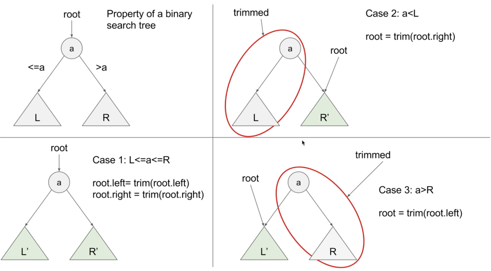

<!-- TOC -->

- [模版](#模版)
    - [递归1 前中后序](#递归1-前中后序)
    - [递归2 前中后序 （通用模板，可以适应不同的题目，添加参数、增加返回条件、修改进入递归条件、自定义返回值）](#递归2-前中后序-通用模板可以适应不同的题目添加参数增加返回条件修改进入递归条件自定义返回值)
    - [迭代1](#迭代1)
    - [迭代2：前、中、后序遍历通用模板（只需一个栈的空间）](#迭代2前中后序遍历通用模板只需一个栈的空间)
    - [层序遍历最常用模板](#层序遍历最常用模板)
- [leetcode](#leetcode)
    - [94 中序遍历](#94-中序遍历)
    - [144 前序](#144-前序)
    - [145 后序](#145-后序)
    - [429 N叉树层序遍历](#429-n叉树层序遍历)
    - [589 N 叉树前序遍历](#589-n-叉树前序遍历)
    - [590 N 叉树后序遍历](#590-n-叉树后序遍历)
    - [987 二叉树的垂序遍历](#987-二叉树的垂序遍历)
    - [1302 层数最深叶子节点的和](#1302-层数最深叶子节点的和)
    - [100. 相同的树](#100-相同的树)
    - [101 Symmetric Tree](#101-symmetric-tree)
    - [104. Maximum Depth of Binary Tree](#104-maximum-depth-of-binary-tree)
    - [110. Balanced Binary Tree](#110-balanced-binary-tree)
    - [111. Minimum Depth of Binary Tree](#111-minimum-depth-of-binary-tree)
    - [572. Subtree of Another Tree](#572-subtree-of-another-tree)
    - [965. Univalued Binary Tree](#965-univalued-binary-tree)
    - [814. Binary Tree Pruning](#814-binary-tree-pruning)
    - [669. Trim a Binary Search Tree](#669-trim-a-binary-search-tree)
    - [1325. Delete Leaves With a Given Value](#1325-delete-leaves-with-a-given-value)
    - [112. Path Sum](#112-path-sum)
    - [113. Path Sum II](#113-path-sum-ii)
    - [437. Path Sum III](#437-path-sum-iii)
    - [129. Sum Root to Leaf Numbers](#129-sum-root-to-leaf-numbers)
    - [257. Binary Tree Paths](#257-binary-tree-paths)
    - [236. Lowest Common Ancestor of a Binary Tree](#236-lowest-common-ancestor-of-a-binary-tree)
    - [235. Lowest Common Ancestor of a Binary Search Tree](#235-lowest-common-ancestor-of-a-binary-search-tree)
    - [297. Serialize and Deserialize Binary Tree](#297-serialize-and-deserialize-binary-tree)
    - [449](#449)

<!-- /TOC -->

# 模版

## 递归1 前中后序
```python
	class Solution:
	    def inorderTraversal(self, root: TreeNode) -> List[int]:
	        if not root: return []
	        return self.inorderTraversal(root.left) + [root.val] + self.inorderTraversal(root.right)
```
## 递归2 前中后序 （通用模板，可以适应不同的题目，添加参数、增加返回条件、修改进入递归条件、自定义返回值）
```python
class Solution:
    def inorderTraversal(self, root: TreeNode) -> List[int]:
        def dfs(node):
            if not node:
                return
            dfs(node.left)
            res.append(node.val)
            dfs(node.right)
        res = []
        dfs(root)
        return res
```

## 迭代1
```python
# 前序后序
class Solution:
    def preorderTraversal(self, root: TreeNode) -> List[int]:
        if not root:
            return []
        res = []
        stack = [root]
        # # 前序迭代模板：最常用的二叉树DFS迭代遍历模板
        while stack:
            cur = stack.pop()
            res.append(cur.val)
            if cur.right:
                stack.append(cur.right)
            if cur.left:
                stack.append(cur.left)
        return res

        # # 后序迭代，相同模板：将前序迭代进栈顺序稍作修改，最后得到的结果反转
        # while stack:
        #     cur = stack.pop()
        #     if cur.left:
        #         stack.append(cur.left)
        #     if cur.right:
        #         stack.append(cur.right)
        #     res.append(cur.val)
        # return res[::-1]
```
## 迭代2：前、中、后序遍历通用模板（只需一个栈的空间）
```python
class Solution:
    def inorderTraversal(self, root: TreeNode) -> List[int]:
        res = []
        stack = []
        cur = root
        # 中序，模板：先用指针找到每颗子树的最左下角，然后进行进出栈操作
        while stack or cur:
            while cur:
                stack.append(cur)
                cur = cur.left
            cur = stack.pop()
            res.append(cur.val)
            cur = cur.right
        return res

        # # 前序，相同模板
        # while stack or cur:
        #     while cur:
        #         res.appen(cur.val)
        #         stack.append(cur)
        #         cur = cur.left
        #     cur = stack.pop()
        #     cur = cur.right
        # return res

        # # 后序，相同模板
        # while stack or cur:
        #     while cur:
        #         res.append(cur.val)
        #         stack.append(cur)
        #         cur = cur.right
        #     cur = stack.pop()
        #     cur = cur.left
        # return res[::-1]
```
## 层序遍历最常用模板
```python
class Solution:
    def levelOrder(self, root: TreeNode) -> List[List[int]]:
        if not root:
            return []
        cur, res = [root], []
        while cur:
            lay, layval = [], []
            for node in cur:
                layval.append(node.val)
                if node.left: lay.append(node.left)
                if node.right: lay.append(node.right)
            cur = lay
            res.append(layval)
        return res


class Solution:
    def levelOrder(self, root: TreeNode) -> List[List[int]]:
        if not root: return []
        que = [root]
        res = []
        while que:
            level = []
            for i in range(len(que)):
                cur = que.pop(0)
                level.append(cur.val)
                if cur.left: que.append(cur.left)
                if cur.right: que.append(cur.right)
            res.append(level)
        return res
```

# leetcode
```python
# Definition for a binary tree node.
# class TreeNode:
#     def __init__(self, val=0, left=None, right=None):
#         self.val = val
#         self.left = left
#         self.right = right
```
## 94 中序遍历
## 144 前序
## 145 后序
## 429 N叉树层序遍历
```python
"""
# Definition for a Node.
class Node:
    def __init__(self, val=None, children=None):
        self.val = val
        self.children = children
"""
class Solution:
    def levelOrder(self, root: 'Node') -> List[List[int]]:
        if not root: return []
        que = [root]
        res = []
        while que:
            level = []
            for i in range(len(que)):
                cur = que.pop(0)
                level.append(cur.val)
                for node in cur.children:
                    que.append(node)
            res.append(level)
        return res
```
## 589 N 叉树前序遍历
```python
"""
# Definition for a Node.
class Node:
    def __init__(self, val=None, children=None):
        self.val = val
        self.children = children
"""
class Solution:
    def preorder(self, root: 'Node') -> List[int]:
        if not root: return []
        res = []
        stack = [root]
        while stack:
            cur = stack.pop()
            res.append(cur.val)
            stack.extend(cur.children[::-1])
        return res
```
## 590 N 叉树后序遍历
```python
"""
# Definition for a Node.
class Node:
    def __init__(self, val=None, children=None):
        self.val = val
        self.children = children
"""
class Solution:
    def postorder(self, root: 'Node') -> List[int]:
        if not root: return []
        stack = [root]
        res = []
        while stack:
            node = stack.pop()
            res.append(node.val)
            for child in node.children:
                stack.append(child)
        return res[::-1]
```
## 987 二叉树的垂序遍历
```python
# Definition for a binary tree node.
# class TreeNode:
#     def __init__(self, val=0, left=None, right=None):
#         self.val = val
#         self.left = left
#         self.right = right
class Solution:
    def verticalTraversal(self, root: TreeNode) -> List[List[int]]:
        nodes = []
        def dfs(node, row, col):
            if not node:
                return
            nodes.append((col, row, node))
            dfs(node.left, row+1, col-1)
            dfs(node.right, row+1, col+1)
        dfs(root, 0, 0)
        nodes.sort()
        lastcol = float('-inf')
        res = []
        for col, row, node in nodes:
            if col != lastcol:
                lastcol = col
                res.append([])
            res[-1].append(node.val)
        return res
```
## 1302 层数最深叶子节点的和
```python
# Definition for a binary tree node.
# class TreeNode:
#     def __init__(self, val=0, left=None, right=None):
#         self.val = val
#         self.left = left
#         self.right = right
class Solution:
    def deepestLeavesSum(self, root: Optional[TreeNode]) -> int:
        q = collections.deque([(root, 0)])
        maxdep, total = -1, 0
        while len(q) > 0:
            node, dep = q.pop()
            if dep > maxdep:
                maxdep, total = dep, node.val
            elif dep == maxdep:
                total += node.val
            if node.left:
                q.append((node.left, dep + 1))
            if node.right:
                q.append((node.right, dep + 1))
        return total
```
## 100. 相同的树
```python
# Definition for a binary tree node.
# class TreeNode:
#     def __init__(self, val=0, left=None, right=None):
#         self.val = val
#         self.left = left
#         self.right = right

class Solution:
    def isSameTree(self, p: Optional[TreeNode], q: Optional[TreeNode]) -> bool:
        if not p or not q:
            return p==q
        else:
            return p.val==q.val and self.isSameTree(p.left, q.left) and self.isSameTree(p.right, q.right)
```
## 101 Symmetric Tree
```python
class Solution:
    def isSymmetric(self, root: Optional[TreeNode]) -> bool:
        def mirror(root1, root2):
            if not root1 or not root2: return root1==root2
            return root1.val == root2.val and mirror(root1.left, root2.right) and mirror(root1.right, root2.left)
        return mirror(root, root)
```
## 104. Maximum Depth of Binary Tree
```python
class Solution:
    def maxDepth(self, root: Optional[TreeNode]) -> int:
        if not root: return 0
        que = [root]
        res = 0
        while que:
            for i in range(len(que)):
                cur = que.pop(0)
                if cur.left: que.append(cur.left)
                if cur.right: que.append(cur.right)
            res+=1
        return res
```
## 110. Balanced Binary Tree
```python
class Solution:
    def isBalanced(self, root: Optional[TreeNode]) -> bool:
        if not root: return True

        def level(node):
            if not node: return 0
            return 1 + max(level(node.left), level(node.right))

        left = level(root.left)
        right = level(root.right)
        return abs(left-right) <= 1 and self.isBalanced(root.left) and self.isBalanced(root.right)

bottom up:
class Solution:
    def isBalanced(self, root: Optional[TreeNode]) -> bool:
        def dfs(root):
            if not root: return [True, 0]

            left, right = dfs(root.left), dfs(root.right)
            balanced = (left[0] and right[0] and
                       abs(left[1] - right[1]) <= 1)
            return [balanced, 1 + max(left[1], right[1])]
        return dfs(root)[0]
```
## 111. Minimum Depth of Binary Tree
```python
class Solution:
    def minDepth(self, root: Optional[TreeNode]) -> int:

        def dfs(root):
            if not root: return 0
            left, right = dfs(root.left), dfs(root.right)
            if left == 0 or right == 0:
                return max(left, right) + 1
            else: return min(left, right) + 1
        return dfs(root)

```
## 572. Subtree of Another Tree
```python
class Solution:
    def isSubtree(self, root: Optional[TreeNode], subRoot: Optional[TreeNode]) -> bool:

        def dfs(root1, root2):
            if not root1 or not root2:  # 空节点
                return root1 == root2
            return root1.val == root2.val and dfs(root1.left, root2.left) and dfs(root1.right, root2.right)

        que = [root]
        while que:
            cur = que.pop(0)
            if dfs(cur, subRoot):
                return True
            if cur.left: que.append(cur.left)
            if cur.right: que.append(cur.right)
        return False


class Solution:
    def isSubtree(self, root: Optional[TreeNode], subRoot: Optional[TreeNode]) -> bool:

        def isSameTree(root1, root2):
            if not root1 or not root2:  # 空节点
                return root1 == root2
            return root1.val == root2.val and isSameTree(root1.left, root2.left) and isSameTree(root1.right, root2.right)

        if not root: return False
        elif dfs(root, subRoot): return True
        else:
            return self.isSubtree(root.left, subRoot) or self.isSubtree(root.right, subRoot)
```
## 965. Univalued Binary Tree
```python
class Solution:
    def isUnivalTree(self, root: Optional[TreeNode]) -> bool:
        val = root.val
        def dfs(root, val):
            if not root: return True
            return root.val == val and dfs(root.left, val) and dfs(root.right, val)
        return dfs(root, val)
```


## 814. Binary Tree Pruning
```python
class Solution:
    def pruneTree(self, root: Optional[TreeNode]) -> Optional[TreeNode]:
        if not root: return None
        root.left = self.pruneTree(root.left)
        root.right = self.pruneTree(root.right)
        if not root.left and not root.right and not root.val: return None
        return root
```

## 669. Trim a Binary Search Tree

```python
class Solution:
    def trimBST(self, root: Optional[TreeNode], low: int, high: int) -> Optional[TreeNode]:
        if not root: return None

        if root.val < low:
            root = self.trimBST(root.right, low, high)
        elif root.val > high:
            root = self.trimBST(root.left, low, high)
        else: # root.val>=low and root.val <= high
            root.left = self.trimBST(root.left, low, high)
            root.right = self.trimBST(root.right, low, high)
        return root
```

## 1325. Delete Leaves With a Given Value
```python
class Solution:
    def removeLeafNodes(self, root: Optional[TreeNode], target: int) -> Optional[TreeNode]:
        if root.left: root.left = self.removeLeafNodes(root.left, target)
        if root.right: root.right = self.removeLeafNodes(root.right, target)
        return None if not root.left and not root.right and root.val == target else root
```
## 112. Path Sum
```python
class Solution:
    def hasPathSum(self, root: Optional[TreeNode], targetSum: int) -> bool:
        if not root: return False
        if not root.left and not root.right and targetSum-root.val==0: return True
        return self.hasPathSum(root.left, targetSum - root.val) or self.hasPathSum(root.right, targetSum - root.val)
```
## 113. Path Sum II
```python
class Solution:
    def pathSum(self, root: Optional[TreeNode], sum: int) -> List[List[int]]:
        res = []
        self.dfs(root, sum, [], res)
        return res

    def dfs(self, root, sum, ls, res):
        if root:
            if not root.left and not root.right and sum == root.val:
                ls.append(root.val)
                res.append(ls)

            self.dfs(root.left, sum-root.val, ls+[root.val], res)
            self.dfs(root.right, sum-root.val, ls+[root.val], res)
```
## 437. Path Sum III
```python
class Solution:
    def pathSum(self, root: Optional[TreeNode], s: int) -> int:
        return self.helper(root, s, [s])

    def helper(self, node, origin, targets):
        if not node: return 0
        hit = 0
        for t in targets:
            if t == node.val: hit += 1
        targets = [t-node.val for t in targets] + [origin]
        return hit + self.helper(node.left, origin, targets) + self.helper(node.right, origin, targets)

```
## 129. Sum Root to Leaf Numbers
```python
class Solution:
    def sumNumbers(self, root: Optional[TreeNode]) -> int:
        def dfs(root, cur):
            if not root: return 0
            cur = cur * 10 + root.val
            if not root.left and not root.right:
                return cur
            return dfs(root.left, cur) + dfs(root.right, cur)
        return dfs(root, 0)
```

## 257. Binary Tree Paths
```python
class Solution:
    def binaryTreePaths(self, root: Optional[TreeNode]) -> List[str]:
        def dfs(root, path):
            if not root: return
            path += str(root.val) + '->'
            if not root.left and not root.right:
                path = path[:-2]
                res.append(path)
            dfs(root.left, path)
            dfs(root.right, path)
        res = []
        dfs(root, "")
        return res
```


## 236. Lowest Common Ancestor of a Binary Tree
```python
class Solution:
    def lowestCommonAncestor(self, root: 'TreeNode', p: 'TreeNode', q: 'TreeNode') -> 'TreeNode':
        self.ans = None

        def dfs(node):
            if not node: return
            left = dfs(node.left)
            right = dfs(node.right)
            cur = node==p or node==q
            if (left and right) or (cur and right) or (cur and left):
                self.ans = node
                return
            return left or right or cur
        dfs(root)
        return self.ans
```
## 235. Lowest Common Ancestor of a Binary Search Tree
```python
class Solution:
    def lowestCommonAncestor(self, root: 'TreeNode', p: 'TreeNode', q: 'TreeNode') -> 'TreeNode':
        if root.val > p.val and root.val > q.val:
            return self.lowestCommonAncestor(root.left, p, q)
        elif root.val < p.val and root.val < q.val:
            return self.lowestCommonAncestor(root.right, p, q)
        else:
            return root
```
## 297. Serialize and Deserialize Binary Tree
```python
class Codec:
    def serialize(self, root):
        if not root: return 'x'
        return ','.join([str(root.val), self.serialize(root.left), self.serialize(root.right)])
    def deserialize(self, data):
        # The reason I use self.data in the deserialize is, data stream will be consumed  as we build left side of Tree
        # by the time when the right side is building up, we need to hold what is left over.
        # Therefore, self.data is a global value, right side will use what is left over after tree is partially built
        self.data = data
        if self.data[0] == 'x': return None
        node = TreeNode(self.data[:self.data.find(',')])
        node.left = self.deserialize(self.data[self.data.find(',')+1:])
        node.right = self.deserialize(self.data[self.data.find(',')+1:])
        return node
```
## 449
